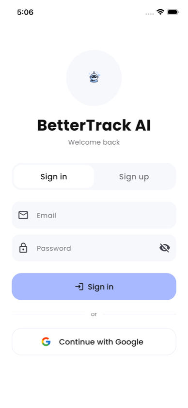
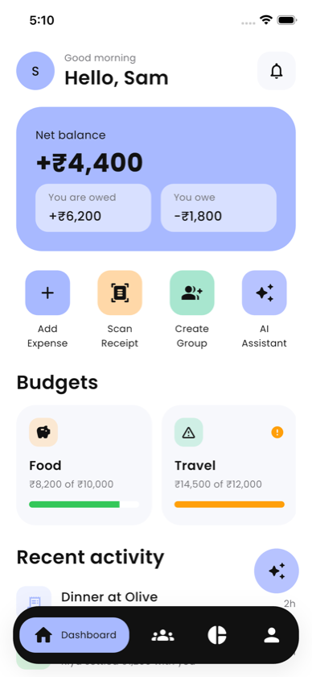
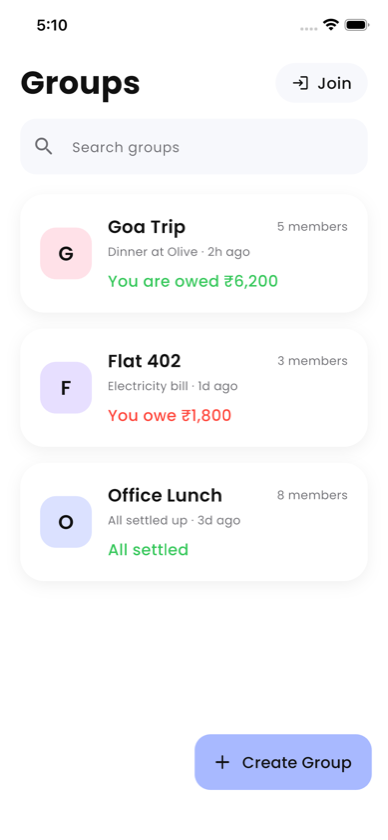
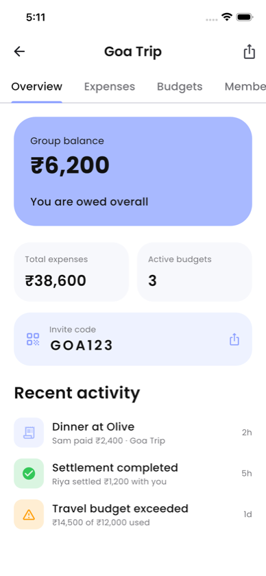
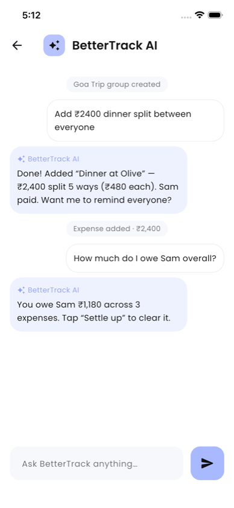
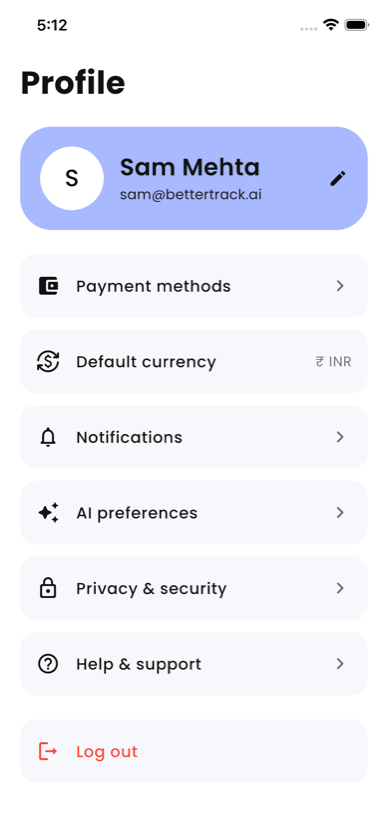
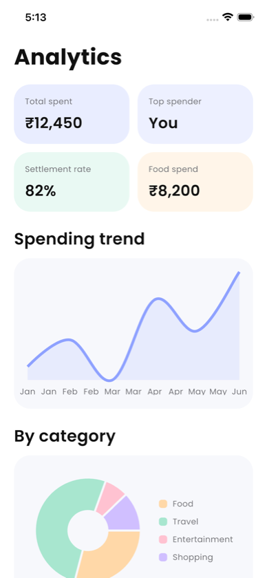

<div align="center">
  
  <h1>BetterTrack AI</h1>
  <p><b>An AI-native expense, budget & group settle-up app.</b><br/>
  Splitwise × Revolut × Apple Wallet — with a Gemini assistant built in.</p>
</div>

---

## What is BetterTrack AI?

Splitting money with friends is annoying: who paid, who owes whom, and chasing
people to settle up. BetterTrack AI turns that into a calm, card-first app where
you can **add an expense, split it, track budgets, and just ask the AI** what you
owe — in plain English. It's a Flutter app backed by a FastAPI service, with a
Google **Gemini** assistant that understands messages like *"I spent ₹1,200 on
dinner for 4."*

| | |
|---|---|
| **App** | Flutter 3.41 / Dart 3.11 (iOS + Android) |
| **Backend** | FastAPI (Python), Gemini 2.5 Flash, Tesseract OCR |
| **Auth** | Email/password + Google sign-in |
| **State** | Live REST data with loading / error / success everywhere |

---

## The app at a glance

<div align="center">



</div>
<div align="center">



</div>

---

## Features — what, why & how

###  Sign in / Sign up


**What:** Email/password sign-up & sign-in, plus *Continue with Google*. The
brand mascot greets you; the password field has a show/hide toggle and inline
validation.

**Why it exists:** Money data is personal. An account gates the app behind the
`AuthGate` so each person sees only their own balances, and it's the foundation
for syncing across devices.

**How it works:** `POST /auth/signup` / `/auth/login` return a token stored in
`shared_preferences`. The `AuthGate` watches that token and instantly switches
between the login screen and the app. Wrong password → `401`, duplicate email →
`409`, both surfaced as friendly messages.

<br clear="all"/>

###  Dashboard


**What:** Your money in one glance — **net balance** (you're owed vs. you owe),
quick actions (Add Expense, Scan Receipt, Create Group, AI), horizontally
scrolling **budgets**, and a live **recent activity** feed.

**Why it exists:** The first question is always *"where do I stand?"* The balance
card answers it immediately; budgets warn you before you overspend (Travel turns
orange when it's over limit).

**How it works:** Pulls `/summary`, `/budgets` and `/activity` in parallel with
pull-to-refresh. Every section shows a branded spinner while loading and an
error card with **Retry** if the network drops.

<br clear="all"/>

###  Groups, Create & Join


**What:** A searchable list of your groups with per-group balances. **Create a
group** (name, currency, members) or **Join** one with a 6-character code.

**Why it exists:** Shared costs happen in circles — a trip, a flat, an office
lunch. Groups keep each set of expenses and balances separate and clear.

**How it works:** `GET/POST /groups`. Creating a group generates a unique,
human-friendly code (no confusing `0/O/1/I`). Joining hits `POST /groups/join`;
a bad code returns a clear *"that code doesn't exist."*

<br clear="all"/>

###  Share & invite (group code + link)


**What:** Inside a group: tabs for Overview, Expenses, Budgets, Members, and
**Chat**. The Overview shows an **invite code** card; the share icon opens a
sheet with the big code, **Copy**, and the native **Share** sheet (link +
code).

**Why it exists:** A group is useless alone. Sharing has to be one tap — so a
friend can join from a WhatsApp message in seconds.

**How it works:** Each group exposes `code` and a `shareLink`
(`https://bettertrack.ai/join/<code>`). Share uses `share_plus`; Copy uses the
system clipboard. Expenses load live per group with their own loading/error
states.

<br clear="all"/>

###  AI assistant (Gemini)


**What:** Chat with **BetterTrack AI** inside any group. Ask *"how much do I owe
Sam?"* or say *"add ₹2,400 dinner split between everyone"* and it drafts the
expense for you to confirm. A typing indicator shows while it thinks.

**Why it exists:** Forms are friction. Natural language is the fastest way to log
and understand spending — the assistant turns a sentence into a structured
expense.

**How it works:** `POST /ai/chat` calls **Gemini 2.5 Flash** server-side (key in
`.env`). The model can be slow, so the app gives this call a 60s timeout (the
old 10s limit was the cause of the "server took too long" error) and falls back
gracefully if no key is set.

<br clear="all"/>

###  Profile & settings


**What:** Edit your profile, pick a **default currency**, toggle
**notifications**, tune **AI preferences**, set **privacy** options, manage
**payment methods**, read **Help/FAQ**, and **log out**.

**Why it exists:** Real apps remember your choices. Every row here is functional
and persisted — not a placeholder.

**How it works:** A reactive `AppSettings` store on `shared_preferences`; the
header and currency update live as you change them. Log out clears the auth
token and returns you to the login screen.

<br clear="all"/>

###  Analytics


**What:** Spend trend (line) and category breakdown (pie), plus stat cards —
total spent, top spender, settlement rate, food spend.

**Why it exists:** Tracking is only useful if it tells you something. Analytics
turns raw expenses into "where is my money going?"

**How it works:** `fl_chart` renders the visuals from the same expense data the
rest of the app uses.

<br clear="all"/>

---

## Design language

Pulled 1:1 from [`design.md.md`](design.md.md): **Poppins** type (bundled
offline), a pastel-blue primary (`#A8B9FF`), soft 24–32px rounded cards, large
56px touch targets, and a custom branded loading spinner (a rotating gradient
ring around a pulsing wallet). Every async surface follows the same
**loading → content → error+retry** lifecycle, and every action gives
success/failure feedback — so a flaky network never leaves a dead screen.

## Project structure

```
app/        Flutter app
  lib/
    theme/        colors, typography, spacing (from design.md)
    models/       Expense, Group, Budget, Activity, Summary (+ fromJson)
    services/     api_client, repository, settings, async_value
    widgets/      brand_spinner, async_view, state_button, cards
    screens/      login, auth_gate, dashboard, groups, group_details,
                  ai_chat, profile, settings, add_expense, create/join/share
backend/    FastAPI service (auth, groups, expenses, budgets, AI, OCR)
BetterTrack/  Obsidian notes documenting the build
docs/screenshots/  the images in this README
```

---

##  Importing the flat's spreadsheet (settle-up engine)

Real expense data is messy. The app ingests `expenses_export.csv` and turns it
into a clean **who-pays-whom** plan, logging every anomaly and the action taken
(see the generated [`IMPORT_REPORT.md`](IMPORT_REPORT.md),
[`SCOPE.md`](SCOPE.md), [`DECISIONS.md`](DECISIONS.md)).

It directly answers each flatmate:

| Flatmate | Ask | How |
|---|---|---|
| **Aisha** | one number per person | greedy **minimum-cash-flow** settle-up (fewest transfers) |
| **Rohan** | show the expenses behind a balance | `GET /import/balance/{person}` — every line |
| **Priya** | dollars aren't rupees | USD→INR conversion at a documented rate |
| **Sam** | March bills shouldn't hit me | **membership windows** — off-period members dropped from splits |
| **Meera** | approve deletions/changes | destructive anomalies flagged `needs_approval` |

Handled anomalies include duplicates, settlements mislabelled as expenses,
`"1,200"`/` 1450 ` number formats, mixed `DD/MM` vs ISO vs `"Mar 14"` dates,
110% percentage splits, a guest (Kabir) whose share is absorbed by his sponsor,
zero/negative amounts and a missing payer. A hard invariant — **all balances sum
to ₹0** — guards the math.

```bash
curl localhost:8000/api/import/report          # anomalies + settle-up plan
curl localhost:8000/api/import/balance/Rohan   # itemised, no magic numbers
```

##  Backend architecture & how it's connected

```
                 Flutter app
                     │  HTTP/JSON (api_client → repository)
                     ▼
        FastAPI (app/main.py)  ──CORS──►  /api router (api/routes.py)
                     │
   ┌─────────────────┼───────────────────────────────┐
   ▼                 ▼                ▼                ▼
config.py        services/        in-memory         ingest.py
(.env typed)   ai · ocr · auth     stores          (CSV → settle-up)
                 · obsidian      (groups, etc.)
                     │                                │
              Gemini / Tesseract              expenses_export.csv
                     │
              Obsidian vault  ◄── activity notes on each write
```

- **`config.py`** loads typed settings from `.env` (Gemini key, Firebase config,
  OCR provider, Obsidian).
- **`api/routes.py`** is the single router mounted at `/api`; it calls the
  **services** and the in-memory stores.
- **services/** are independent units: `ai_service` (Gemini), `ocr_service`
  (Tesseract), `auth_service` (tokens), `obsidian_sync` (writes notes), and
  `ingest` (the settle-up engine).
- The app talks to the backend only through `api_client.dart` → `repository.dart`,
  so swapping mock ↔ live is one line.

##  Data model & the knowledge graph (Graphify)

Data is held in in-memory stores today, modelled on a relational schema
(`members`, `expenses`, `expense_shares`, `settlements`, `anomalies`,
`fx_rates` — full schema in [`SCOPE.md`](SCOPE.md)). Key relation:
`expenses 1—* expense_shares *—1 members`, with the invariant
`Σ shares = amount` per expense.

**Graphify** (`pip install graphifyy`) parses the whole codebase — including
`ingest.py` and `routes.py` — into a `graph.json` + `graph.html`, so the data
flow *CSV → run_import → net_balances → settle_up → API → app* is a navigable
graph. It keeps the app, backend and Obsidian notes **connected** as the project
grows. Rebuild any time:

```bash
cd backend && source .venv/bin/activate
graphify update ../backend/app && graphify update ../app/lib
```

##  Notifications via Zapier

Outbound notifications are delivered through **Zapier**. The backend posts a JSON
event to a Zapier **Catch Hook** whenever something noteworthy happens (an expense
is added, a member joins, a budget is exceeded). From there a Zap fans the event
out to email / Slack / push without the app needing to own that plumbing.

```
expense added ─► POST {ZAPIER_HOOK_URL} ─► Zapier Zap ─► email · Slack · push
```

Set `ZAPIER_HOOK_URL` in `backend/.env`; if it's unset the app simply skips the
notification (no hard dependency).

## Run it

**Backend**
```bash
cd backend
python3 -m venv .venv && source .venv/bin/activate
pip install -r requirements.txt
cp .env.example .env        # add GEMINI_API_KEY etc.
uvicorn app.main:app --reload --port 8000
```

**App**
```bash
cd app
flutter pub get
flutter run                 # pick the iOS simulator / device
```

> The iOS simulator reaches the backend at `127.0.0.1:8000`. For a real device
> or Android emulator, pass `--dart-define=API_BASE_URL=http://<host>:8000/api`.

## Roadmap

- Settle-up flow (mark balances paid)
- Scan Receipt (OCR) capture UI — endpoint already exists
- Real Google OAuth (needs the iOS Firebase plist)
- Propagate the chosen default currency to every amount
- Durable DB (currently in-memory) + push notifications

---

<div align="center"><sub>Built with Flutter, FastAPI & Gemini.</sub></div>
